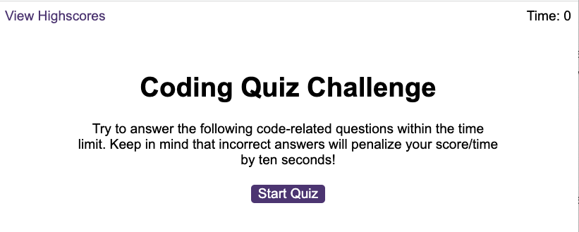
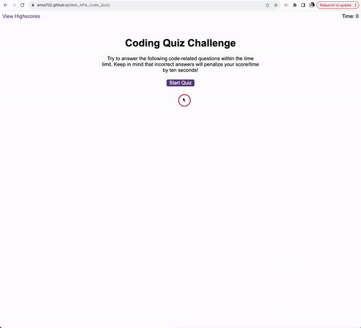

# Web_APIs_Code_Quiz

A timed coding quiz with multiple-choice questions. This app runs in the browser and features dynamically updated HTML and CSS powered by JavaScript code.

## Description

This Code Quiz contains the following features:

- A start button triggers a timer upon clicking, revealing the first question and four answer options.
- When answer is clicked, the next question appears.
- If an incorrect answer is selected, time is deducted from the clock, accompanied by a sound.
- The quiz concludes when all questions are answered or the timer reaches 0.
- Upon completion, the game displays the score and allows users to save their initials and score.

## Project status

Deployed: https://anna702.github.io/Web_APIs_Code_Quiz/

## Project Screenshot

## Project GIF

## License

MIT License

## Q&A

In case you have any questions, feel free to contact me at <a href="mailto:annanvks@gmail.com?">annanvks@gmail.com</a>.
